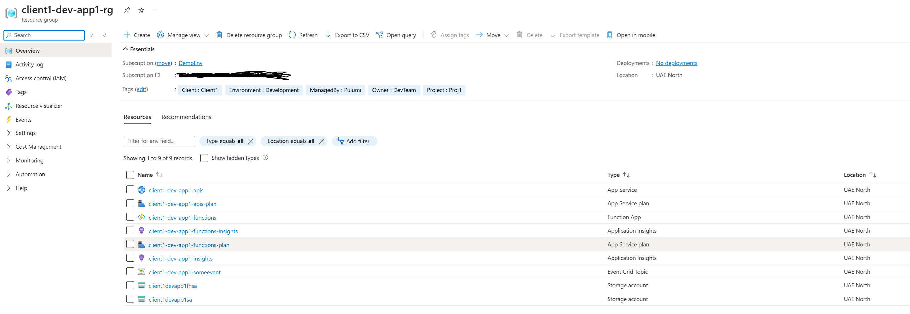

# App1 Infrastructure Template

This is a clean template for creating Azure infrastructure using Pulumi, following a microservices pattern with App Services, Function Apps, Storage Accounts, and Event Grid.

## Directory Structure

```
App1/
├── helpers/
│   ├── App1DeploymentConfigs.cs
│   └── App1SecretAccess.cs
├── stack/
│   ├── App1Stack.cs
│   ├── App1Stack.App1ApiAppService.cs
│   ├── App1Stack.App1FunctionApp.cs
│   ├── App1Stack.App1StorageAccount.cs
│   └── App1Stack.App1EventsEventGrid.cs
├── pre-deploy-scripts/
│   ├── README.md
│   └── add-secrets.ps1
├── post-deploy-scripts/
│   ├── README.md
│   ├── update-app-settings.ps1
│   └── update-function-settings.ps1
├── App1.csproj
├── Program.cs
├── pulumi.client1-dev.yaml
└── pulumi.yaml
```

## Key Components

### 1. Helpers

- **App1DeploymentConfigs.cs**: Configuration management with SharedResources integration
- **App1SecretAccess.cs**: Secure secret handling and blob connection string management

### 2. Stack Components

- **App1Stack.cs**: Main orchestration stack
- **App1Stack.App1ApiAppService.cs**: API App Service with comprehensive configuration
- **App1Stack.App1FunctionApp.cs**: Function App with proper settings
- **App1Stack.App1StorageAccount.cs**: Storage Account configuration
- **App1Stack.App1EventsEventGrid.cs**: Event Grid Topic for event-driven architecture

### 3. Configuration Structure

```yaml
# Docker Settings
App1Infrastructure:DockerSettings:
  DockerApp1ApiImageName: app1-api
  DockerApp1ApiImageTag: latest-tag
  DockerApp1FnImageName: app1-fn
  DockerApp1FnImageTag: latest-tag

# Resource Names
App1Infrastructure:ResourcesNames:
  ResourceGroupName: app1-rg
  App1ApiAppServicePlanName: app1-apis-plan
  App1ApiAppServiceName: app1-apis
  # ... other resource names

# Storage Account Configuration
App1Infrastructure:StorageAccount:
  SkuName: Standard_LRS
  Kind: StorageV2
  AccessTier: Hot
  # ... other storage settings

# Database/Blob Configuration
App1Infrastructure:Database:
  PrimaryBlobAccount: primarysa
  SecondaryBlobAccount: secondarysa
  App1BlobAccount: app1sa

App1Infrastructure:App1ApiAppSettings:
  HealthCheck: /health
  AllowedHosts: "*"
  # App1 Events Configuration
  App1Events:
    topicEndpoint: "https://endpoint.eventgrid.azure.net/api/events"
  # Storage Settings
  StorageSettings:
    SupportedAppsVersionsFile: "app1versions/versions.json"
  # Common Settings
  Common:
    ApiKey: "app1-api-key"
    TimeoutInMinutes: 30
  # Service Icons Options
  ServiceIconsOptions:
    IconPath: "/icons"
    DefaultIcon: "default.png"

# Function Settings
App1Infrastructure:App1FnAppSettings:
  HealthCheck: /api/HealthCheck
  Values:
    FUNCTIONS_WORKER_RUNTIME: dotnet
  # Common Settings
  Common:
    ApiKey: "app1-fn-api-key"
    TimeoutInMinutes: 30
```

### 4. Secret Management

The template includes:
- API keys for secure access
- Storage account keys for blob access
- Event Grid topic keys
- Function-specific secrets
- SendGrid integration for email services

### 5. Infrastructure Components

- **App Service**: Containerized API hosting
- **Function App**: Event-driven compute
- **Storage Account**: Blob and queue storage
- **Event Grid Topic**: Event publishing
- **Application Insights**: Monitoring and telemetry

## Usage

1. **Configure Secrets**:
   ```powershell
   .\pre-deploy-scripts\add-secrets.ps1
   ```

2. **Deploy Infrastructure**:
   ```bash
   pulumi up
   ```

3. **Post-Deploy Configuration**:
   ```powershell
   .\post-deploy-scripts\update-app-settings.ps1
   .\post-deploy-scripts\update-function-settings.ps1
   ```

## Template Features

- **Clean Architecture**: No domain-specific dependencies
- **Shared Resources**: Integrates with SharedResources for common configurations
- **Event-Driven**: Event Grid integration for microservices communication
- **Containerized**: Docker support for both API and Function Apps
- **Secure**: Proper secret management with encrypted storage
- **Scalable**: Modern Azure PaaS services with auto-scaling capabilities
- **Monitoring**: Application Insights integration for observability

## Customization

To use this template for your project:

1. Replace `App1` with your service name throughout the codebase
2. Update the `pulumi.client1-dev.yaml` with your specific configuration
3. Modify the application settings to match your requirements
4. Add/remove Azure resources as needed
5. Update the secret management to match your security requirements

This template provides a solid foundation for Azure microservices infrastructure while remaining flexible and extensible.

## 📸 Expected Deployment Result

After successful deployment, your App1 Resource Group should contain the following resources:



This image shows the complete set of Azure resources that should be created by the App1 template, including:
- App Service for the API
- Function App for event processing
- Storage Account for blob storage and function requirements
- Event Grid Topic for event-driven communication
- Application Insights for monitoring

Use this as a reference to verify your App1 deployment was successful.
