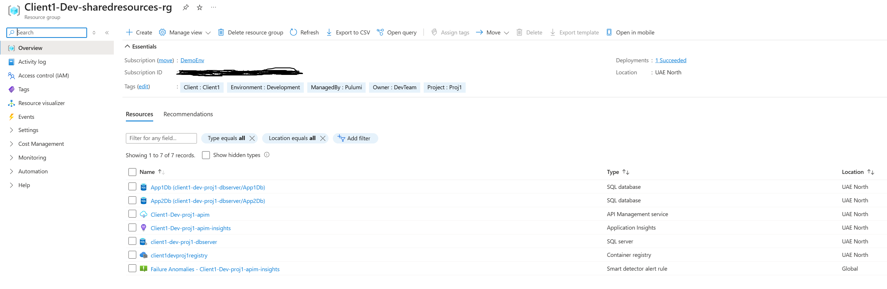

# SharedResources - Azure Infrastructure Template

Pulumi C# template for deploying shared Azure resources with centralized configuration management.

## 📁 Project Structure

### Core Infrastructure Files
- **`Program.cs`** - Entry point for Pulumi
- **`Pulumi.yaml`** - Project definition
- **`Pulumi.client1-dev.yaml`** - Stack configuration (location, SKUs, resource names)
- **`SharedResources.csproj`** - C# project file with dependencies

### Configuration Management
- **`helpers/ConfigParser.cs`** - Utility for parsing YAML config to C# objects
- **`helpers/DeploymentConfigs.cs`** - Main configuration class
- **`helpers/SecretAccess.cs`** - Handles encrypted secrets

### Infrastructure Components
- **`stack/Stack.cs`** - Main stack definition
- **`stack/Stack.SqlServer.cs`** - SQL Server creation
- **`stack/Stack.Databases.cs`** - SQL Database creation
- **`stack/Stack.ContainerRegistry.cs`** - Azure Container Registry
- **`stack/Stack.ApiManagement.cs`** - API Management service

### Setup Scripts
- **`pre-deploy-scripts/setup-pulumi-esc.ps1`** - Creates Pulumi ESC environment for shared config
- **`pre-deploy-scripts/add-client1-secrets.ps1`** - Sets encrypted secrets (SQL passwords, etc.)

## 🚀 Getting Started

### 1. Create Pulumi Project
1. **Create new project in Pulumi Cloud**
   - Navigate to [Pulumi Cloud](https://app.pulumi.com)
   - Create new project with settings:
     - **Source**: Pulumi
     - **Cloud**: Azure
     - **Language**: C#
     - **Name**: `<projectname>-<clientname>` (e.g., `proj1-client1`)

2. **Set up stack naming convention**
   - Stack name format: `<org-name>/<stack-name>`
   - Where stack name follows: `<clientname>-<env>`
   - Example: `some-org/proj1-client1/dev`

### 2. Configure Environment
1. **Update configuration file**
   - Open `pre-deploy-scripts/client-env-configs.txt`
   - Populate with values from Pulumi Cloud portal
   - Include organization name, project name, and environment details

### 3. Set Up ESC Environment
```powershell
# Navigate to SharedResources directory
cd SharedResources

# Navigate to scripts directory
cd pre-deploy-scripts

# Create ESC environment for shared configuration
# (requires client-env-configs.txt to be populated)
.\setup-pulumi-esc.ps1
```

### 4. Configure Secrets
```powershell
# Return to SharedResources directory
cd ..

# Set encrypted secrets (update passwords first)
.\pre-deploy-scripts\add-client1-secrets.ps1
```

### 5. Deploy Infrastructure
```powershell
# Install dependencies
dotnet restore

# Create stack with naming convention: <org-name>/<clientname>-<env>
# Example: some-org/client1-dev
pulumi stack init <org-name>/<clientname>-<env>

# Deploy infrastructure
pulumi up
```

### 6. Verify Deployment
```powershell
# Check deployed resources
pulumi stack output
```

## 📦 What Gets Deployed

### Azure Resources
- **Resource Group** - Container for all resources
- **SQL Server** - Database server with configurable databases (App1Db, App2Db by default)
- **Container Registry** - Docker image registry with admin access
- **API Management** - API gateway service

### ESC Configuration
Shared configuration available to all projects:
- Basic settings (Location, Prefix, Tags)
- Resource naming conventions
- Infrastructure settings and SKUs
- Database configurations

## 🔗 Using in Other Projects

Add to any project's `Pulumi.yaml`:
```yaml
environment:
  - proj1-client1/dev
```

Then access shared config:
```csharp
var config = new Config("SharedResources");
var registryName = config.Require("ResourcesNames:ContainerRegistryName");
var serverName = config.Require("ResourcesNames:DatabaseServerName");
var apimName = config.Require("ResourcesNames:ApiManagementName");
```

## ⚙️ Customization

- **Update resource names** in `Pulumi.client1-dev.yaml`
- **Modify SKUs/sizes** in configuration files
- **Add/remove databases** in the `Databases` array
- **Adjust ESC environment** in `pre-deploy-scripts/setup-pulumi-esc.ps1`
- **Update secrets** via `pre-deploy-scripts/add-client1-secrets.ps1`

## 📊 Outputs

After deployment, get outputs with:
```powershell
pulumi stack output  # See all outputs
pulumi stack output SqlServerFqdn
pulumi stack output ContainerRegistryLoginServer
pulumi stack output ApiManagementServiceUrl
```

## 📸 Expected Deployment Result

After successful deployment, your Azure Resource Group should contain the following resources:



This image shows the complete set of Azure resources that should be created by the SharedResources template, including:
- Resource Group container
- SQL Server with databases
- Container Registry
- API Management service
- Application Insights (for API Management monitoring)

Use this as a reference to verify your deployment was successful.